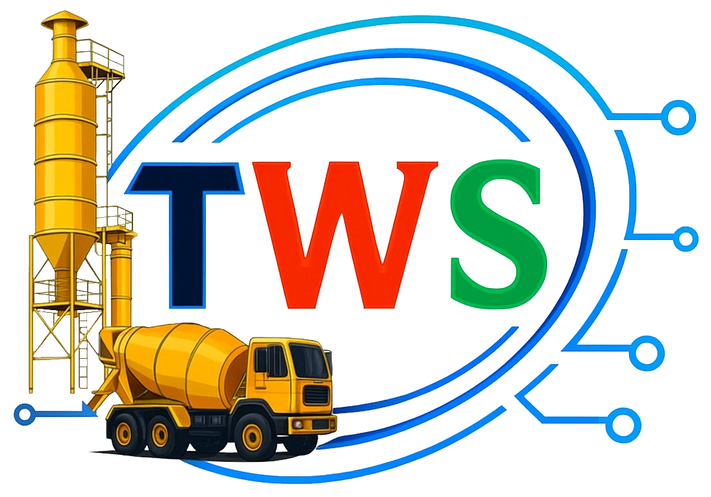
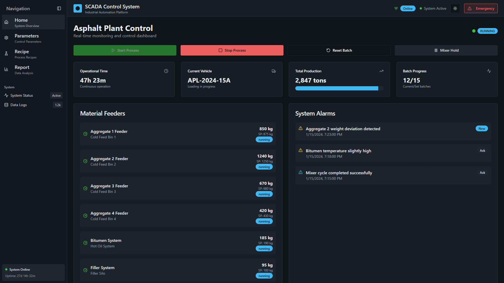
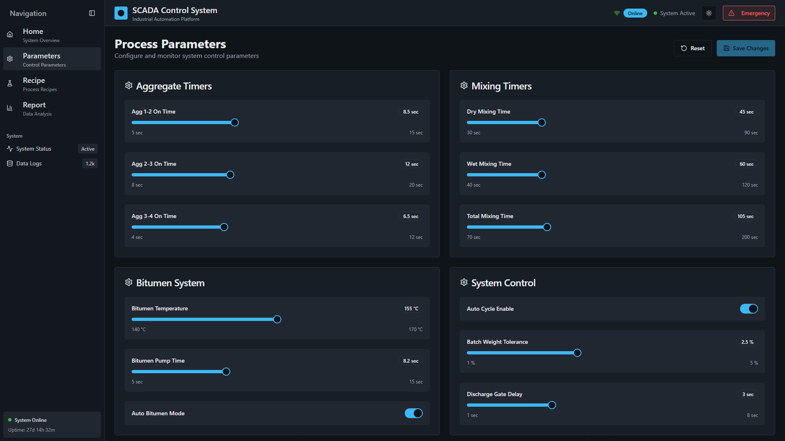
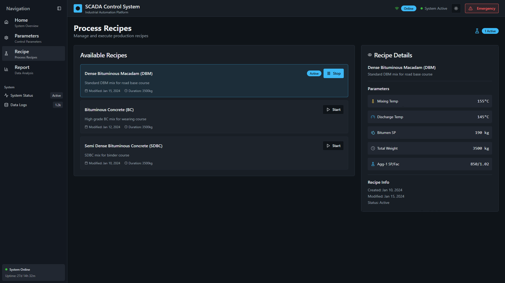
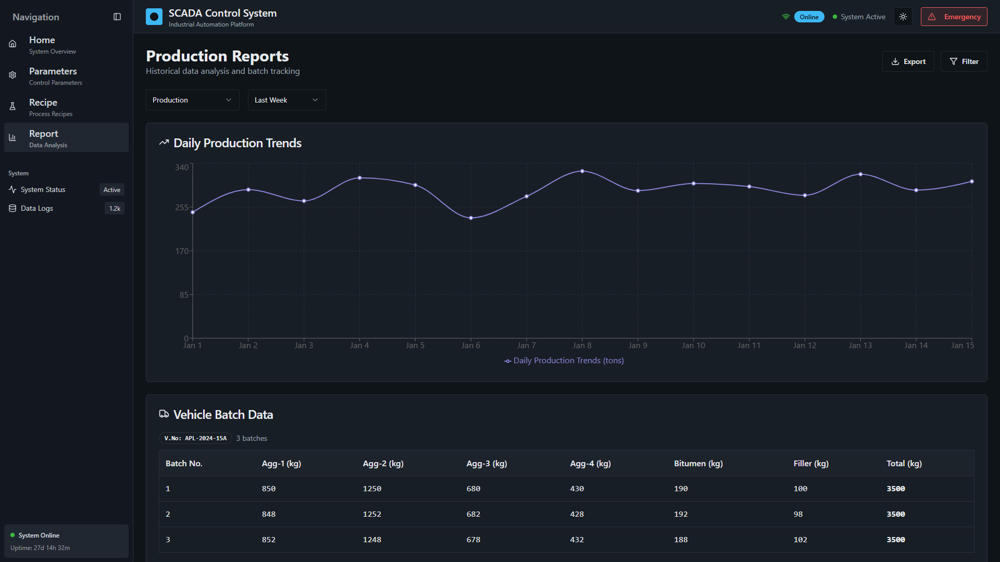

<p align="center">
  
</p>


# SCADA System Desktop App

This project is a modern **SCADA (Supervisory Control and Data Acquisition)** system desktop application. It is built with **Electron, Vite, React, TypeScript, Tailwind CSS, and shadcn/ui**, providing a clean and responsive interface for industrial automation and process monitoring.  

You can work with this project in your local development environment.  

### Requirements
- **Node.js & npm** installed ([Install with nvm](https://github.com/nvm-sh/nvm#installing-and-updating))

### Setup
```sh
# Clone the repository
git clone https://github.com/KevinCalvinNaeem/Electron-SCADA.git

# Navigate to the project directory
cd Electron-SCADA

# Install dependencies
npm install

```

### Running the App
```sh
#Run the Electron app in development mode
npm run dev

#Run the web UI only (without Electron)
npm run dev:web

#Preview the built web UI
npm run preview:web
```
### Building the App

```sh
#Build the Electron app
npm run build

#Build the web UI for production
npm run build:web

#Build the web UI in development mode
npm run build:web:dev
```

### Packaging for Distribution
```sh
# Build and package into an installer (Windows, macOS, Linux)
npm run package
```
### Available Scripts
```json
"scripts": {
  "dev:web": "vite",
  "build:web": "vite build",
  "build:web:dev": "vite build --mode development",
  "preview:web": "vite preview",
  "lint": "eslint .",

  "dev": "electron-vite dev",
  "build": "electron-vite build",
  "preview": "electron-vite preview",
  "package": "npm run build && electron-builder"
}
```

### Technologies Used

- Electron – desktop app framework

- Vite – fast build tool

- React – UI framework

- TypeScript – type safety

- Tailwind CSS – utility-first styling

- shadcn/ui – modern, accessible UI components

To package the application into installers/binaries for your operating system, run npm run package. This will generate cross-platform executables (Windows, macOS, Linux) in the dist directory.

✨ With this setup, you get a modern SCADA desktop application with responsive UI, cross-platform support, and smooth performance.

## Preview

### Home Screen



---

### parameters Screen



---

### Recipe Screen



---

### Report Screen

